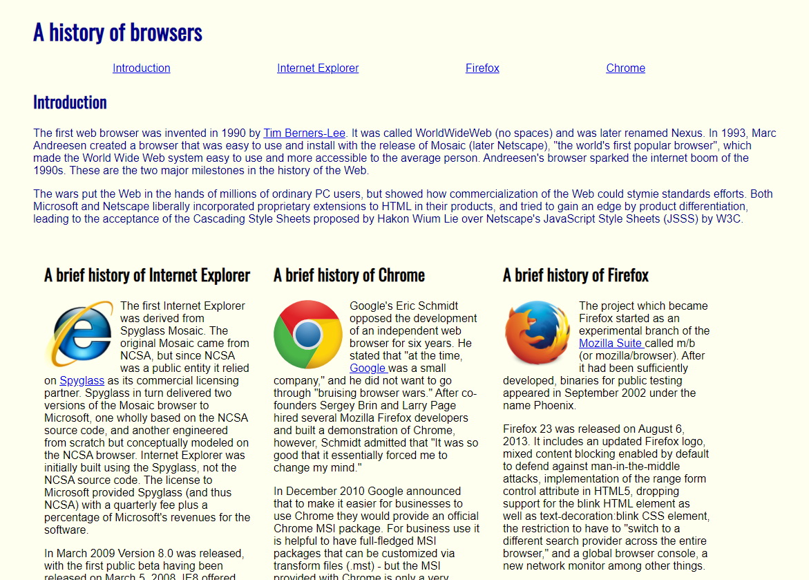
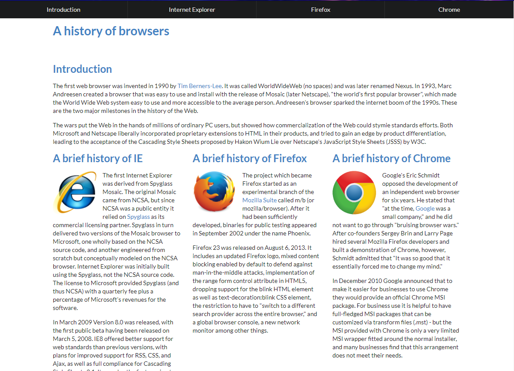

After finishing ICS 311 at UH Manoa, I have learned that software engineering expands on much more ideas than what I previously expected. The general idea you get from software engineering is creating and designing software, this only strikes the surface of what we did because there is so much more that makes up creating usable software programs. 

In this semester, we started by learning Javascript and then went into HTML and CSS creating interfaces and better visuals. When starting HTML and CSS, we quickly learned how hard it is to create visuals which actually look nice and presentable, rather than pages with text and images generically loaded on a screen. This is where we were introduced into User Interface Frameworks. These work as a framework which already has defined elements and layouts, so we are able to use these pre-designed frameworks to build our own customizable pages more effectively. The UI Framework we worked with was Semantic UI, which we used throughout the semester. Semantic UI is great because it offers a lot of possibilities when it comes to creating a web page. My favorite part are the various elements, they  are the different “elements” of the page, such as interactable buttons, images, headers, and even containers which hold other elements. Since they are all within the framework, all we have to do is call it and change the info so it matches out needs. Below are two different renderings of an assignment we had this semester where we built a website showing the history of web browsers. The first one is where we just used HTML and CSS, while the second one we implemented Semantic UI. As you can see, the one using semantic UI is much more presentable while the other seems very outdated. 

 
 

Before this class, I would have not thought that it would be this easy to create presentable web pages which can be used. HTML is easy to pick up, but is really hard to use when wanting to create actual working web pages that are more than just text and images. As said in my previous essays, I want to work with web design and development, and I can easily see myself using Semantic UI in a working field because of how useful and universal it can be when used correctly. In the past I have used only HTML to build websites, and it was a struggle because of how limited HTML can be. Looking back now, it would be so much easier if I knew of the different User Interface Frameworks and used them. 

Another concept that stuck with me this semester was about ethics in software engineering. The idea of ethics extends further than what a person thinks is right and wrong. But in a world of rapidly growing technology, there is not much set in stone right and wrongs in how people interact and use technology. A simple example said in class was based on the question of “Would you follow and do everything your boss tells you without a second thought?” This revolved around the Facebook Crisis in 2017 where they publicly released that Russian agents were using facebook as a way to disrupt the United States presidential election. The idea of ethics here was that they kept this a secret for about a year and were hesitant to stop it. One of the social network’s security chiefs knew of this a year before but were told to privately research it. This may have been good for the company to keep this a secret at the time, but with around 3,000 ads being spread around Facebook by Russian agents, this nationally affected the public and potentially swayed the election at the time. Since technology is growing so fast, it is affecting things in a way never before. We have not really seen anything like this before, so there is not much of an immediate general response to this. 

During this time we also learned about the Association for Computing Machinery Code of Ethics and Professional Conduct, which are sets of standards which outline what is ethical within the world of technology. As a class we went through several questions that discussed the ethics of what happened according to the ACM code of ethics. From this, I learned more about what is standar correct in the world of computing machinery and it made me think more critically about what is ethical from a personal vs company standpoint. Ideally, a company should care about what is ethically right for their users, but in most cases they may skip things in order to make profit. As someone who wants to work in web development and cyber security, it is making me think more of what I think is ethically right and how I would want to keep inline with the code of ethics in my work. Coming from this class, this topic does not seem to directly relate to the process of developing software, but it does play an important role into developing good software which will respect its users. 

Coming from this class, I feel like instead of just learning how to code and write programs, we got the full experience and background of learning, developing, and working with others to develop and design a working site. We also gain valuable ideas and ethics towards working in this field and what to expect. The initial idea of software engineering when coming into this class seemed interesting in itself, but after this class as a whole gave me a new light as to what it takes to become one and the mindset to succeed.

Overall, I believe that coding standards are an important part of coding. For me personally, they have helped me learn and apply new things when working with new languages. They also help in group situations and universally so everyone can easily read and understand others codes. Even though they may be tedious and not seem necessary when working on personal projects, in the long run it is an important skill to keep. 
