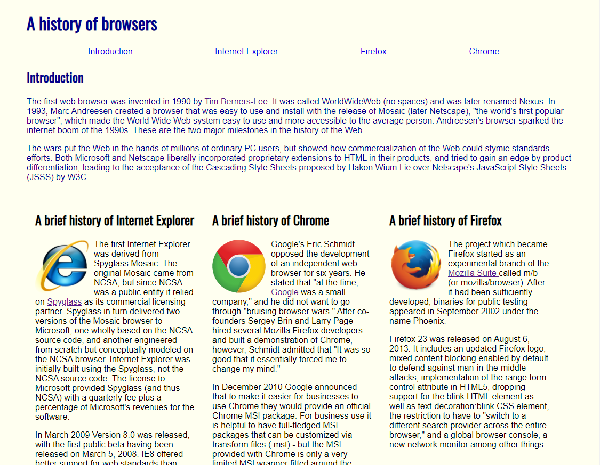

When I first started learning how to code, specifically working with Java, learning how to correctly format and type everything was one of the hardest concepts for me to understand. Since coding languages are in a way abstract compared to learning other subjects, it’s not very easy getting used to all the new formatting requirements. But, I personally really like how most coding languages have a stand for how it should look because once you begin to understand what that is, it is easier to use and implement it. For example, when I first learned how to create and use functions it did not make any sense to me. But from looking and comparing different examples that follow the same suit, it helped me learn by giving me a generic format I could follow and practice until I understood enough to make my own. 

As of now, I am learning Javascript and Underscore and using ESLint with IntelliJ. IntelliJ IDEA is a IDE which we use to code into and ESLint is a plugin which checks our code for syntactic mistakes so we follow a set coding standard. In my previous post regarding my thoughts about learning Javascript and I generally said that I enjoy the language. But now since it has been a few more weeks into practicing and constantly using it, there are a lot more things that I discovered that are completely different and new from what I know from previous coding languages. One obvious example is our implementation of Underscore into our code. Underscore is a Javascript library that adds new concepts and applications of functional programming. But, along with learning a new language we are using ESLint which very strictly points out any mistakes in our formatting. 

At first when we started using this new program I did not see that point because we were previously using JSFiddle which already is a developmental environment for Javascript and is much easier to use. From using IntelliJ a few times, I can see that it has much more capabilities and uses than JSFiddle has, but it has a higher skill curve since it is not very intuitive to begin with. Along with IntelliJ there is ESLint which checks our formatting. I really like this because it shows how many errors and where your errors are in regard to incorrect formatting. As said before, I prefer universal coding standards because it helps me compare code with other examples to find errors or develop my own version. For example, if I have two functions where one works and one doesn’t, if they are both formatted correctly I can pick out bugs quicker and correct my code. One other aspect of ESLint is that for the errors they show them with red ‘x’ marks, so when finalizing your code you are able to work though and fix your mistakes till it shows you a green check mark. It’s a very trivial graphic, but it helps me easily see how much errors I have and when everything is good to go. 

 

 

 
 
 
 
 
 
 
 
 
 

The first image is one of my first assignments using only HTML, while the second is a my personal recreation of a website. From this you can see that one is much better looking that then other, but my recreation was also easier to format and quicker to make. 

Overall, I believe that coding standards are an important part of coding. For me personally, they have helped me learn and apply new things when working with new languages. They also help in group situations and universally so everyone can easily read and understand others codes. Even though they may be tedious and not seem necessary when working on personal projects, in the long run it is an important skill to keep. 
