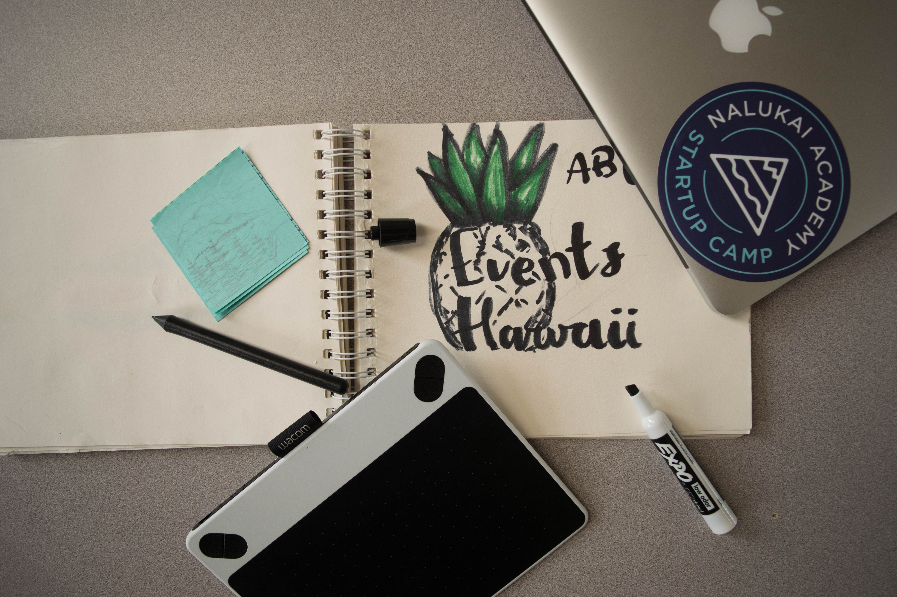

	During the summer of 2018, along with three other collaborators from various Hawaiian islands, we created a website which allows people from around the different island communities to post and share what’s going on around them. Our main inspiration was the lack of inter island news that was coming from local communities, the only real and quick source of local new stations, but we wanted something which was run and used by the public. 
Our website would offer anyone to sign up and be able to share what is currently going on around them.  We would also be continuously adding and updating public information towards events and gatherings and other main news. Our goal was to create something similar to a social media and Reddit, but more accessible and locally centralized. 
During this summer camp we were given a full week to create and design our idea and then at the end present it to our peers and other notable members of the community. We were able to create a mock website using HTML and Javascript, we were not able to implement a system of allowing people to sign up and post, but if we come back to this project we plan on implementing that and a data system to store and easily access information. 

