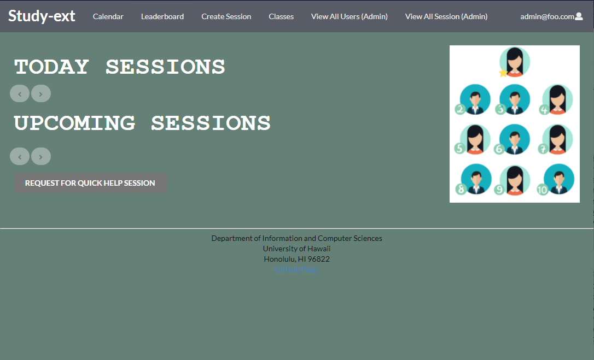
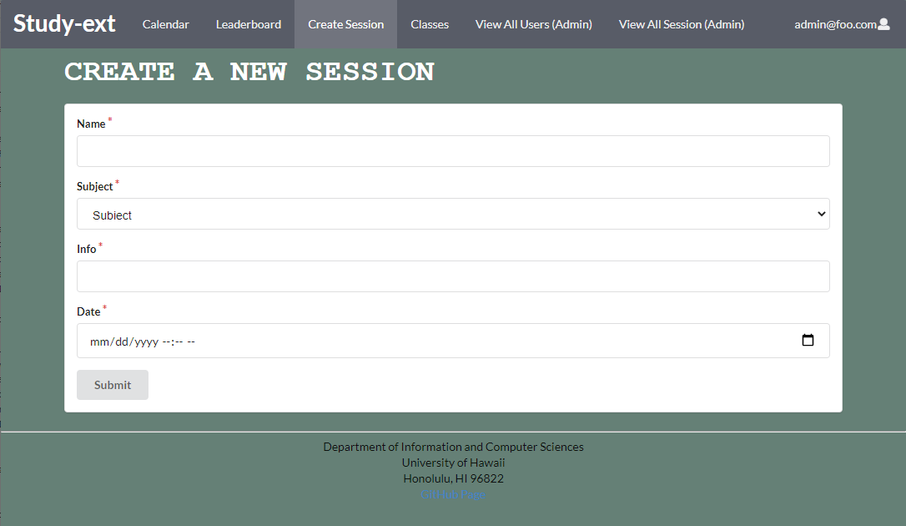
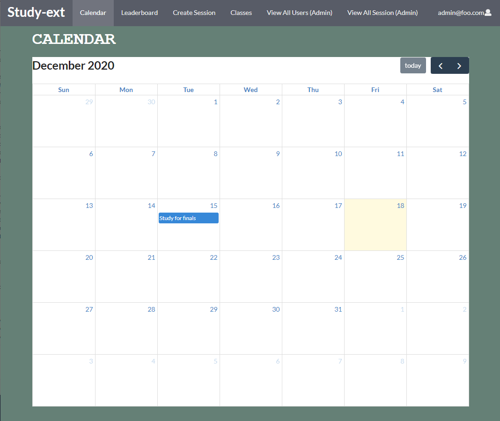

Me and three other students in my ICS 314 Software Engineering class were given the project of developing a site. The goal of our project was to create a site which computer science students at our school would be able to create study sessions which others can view and sign up for to join. Along with them, there are mentors who join these sessions to help the mentees study or review things they may have missed in class. The overall goal was to help students get together and study. To help motivate them, we tried to implement a point system which would allow for students and mentors who attend these sessions to gain points which would help them reach higher positions on the site's leaderboard. Allowing everyone to see who is attending these sessions and raising on the leaderboard would help motivate students to use this resource and take advantage of it. 

For this project, I design the collections which are holding the information for the students and sessions on the site. I also created all the sample data for the students and sessions, so viewers are able to get a better understanding of what our site is supposed to do and look like when it is actually used. I also implemented the admin pages which allow you to view all the users and upcoming sessions, so you can easily maintain and keep tabs on who is using the site and upcoming sessions. Lastly, I implemented the create session tab which allows for students to be able to create new sessions and add in all the information for what class, when it’s happening, and what the general topic they are going over. To the left are larger images of what the create and calendar page looks like.

Overall, after finishing this project, I learned a lot about creating a working site and collaborating with others. Even though we learned a lot and implemented various types of sites for homework in class, I have encountered many problems which I have not faced before. I am not sure if it was more of a github problem or just an error in my code, but there would be days where nothing would work and then the next day it would work fine with no changes. Also with how vast and complicated meteor can get, it took some time to learn how to implement new things and have collections work with various pages. As for working with others, it was a nice but also stressful experience. We were able to talk and decide pretty quickly on what we wanted to do, but then slowed down after that because our ideas took some time to implement. I personally had trouble working with certain pages because of changes in code from other collaborators without notice, so I would need to fix my code and figure out how to make it work again. 

My overall consensus is that this experience working on this project helped me learn as to what working with others on bigger projects can be like. It was very stressful and I wish we had more time and less errors, but I think that we were able to get the good idea of what we wanted out there. 

[Here](https://study-ext.xyz/#/) is a working link to our deployment of our page. You are able to sign up or log in using the default email: john@foo.com and password: changeme. 
[Here](https://study-ext.github.io/) is our github website showing the development of the site. 

